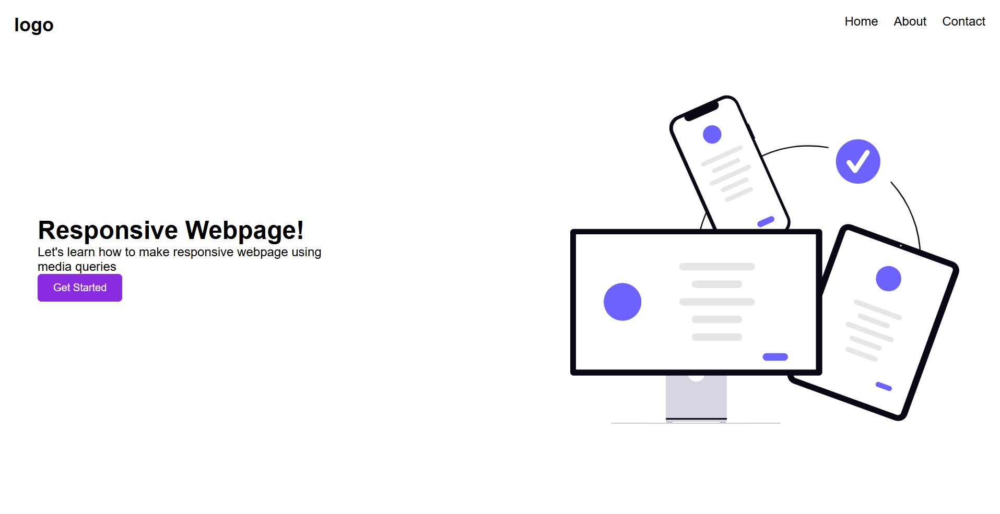
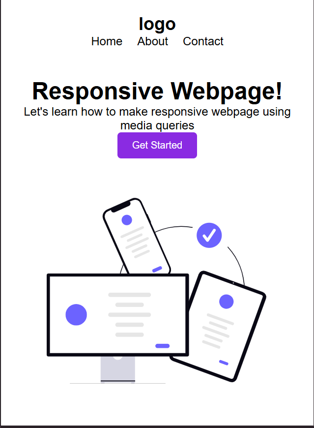

# Responsive Landing Page

A simple responsive landing page built using HTML and CSS.

## Features

* Responsive design using CSS Media Queries
* Desktop and Mobile friendly layout
* Navigation bar with menu links
* Hero section with heading, description, button, and illustration
* Flexbox used for layout management
* Responsive image scaling

## Technologies Used

* HTML5
* CSS3
* Flexbox
* Media Queries

## Project Structure

```
Responsive-Landing-Page/
│
├── index.html
├── style.css
├── images/
│   └── responsive-design.svg
├── desktop_view.png
├── mobile_view.png
└── README.md
```

## Screenshots

### Desktop View




### Mobile View



## Learning Outcomes

Through this project, I learned:

* How to build responsive web pages
* How to use Flexbox for layouts
* How to apply Media Queries for different screen sizes
* How to create mobile-friendly user interfaces

## Author

Aishwarya Thorat
